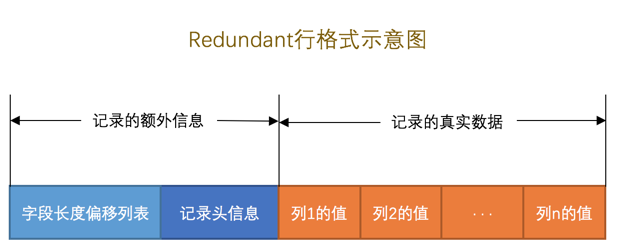

# MySQL数据库中变长数据的存储
## InnoDB简介
InnoDB是MySQL默认的存储引擎。InnoDB在数据库中读取数据的方式：**将数据划分为若干页，再读区数据时以页作为磁盘和内存交互的基本单位，页的大小一般为16KB**。InnoDB存储引擎的常用数据记录格式有四种，分别是：**Compact**,**Redundant**,**Dynamic**,**Compressed**,可以在创建数据库表时指定记录格式。
## 文件存储
mysql存储的文件包括参数文件、日志文件、套接字文件、pid文件、表结构文件和存储引擎文件。  
innodb的存储引擎文件包括表空间文件和重做日志文件。  
系统表空间（ibdata）记录了InnoDB的核心信息，包括事务系统信息和元数据信息，对应系统上一个或多个实际文件。
独立表空间文件用来存储每个表的数据，有多少表就对应多少独立表空间，存储在后缀为.ibd的文件中。

## 其他存储引擎
### MyISAM
MyISAM的所有索引都是二级索引，数据和索引是分开存储的，且表数据是存储在数据库子目录下，不存在表空间。它不支持事务、外键约束和行级锁，每次操作数据时会锁定整个表。
###MEMORY
使用内存空间创建表，使用hash索引定位数据，有很快的数据访问速度，但一旦关闭数据会消失。
## 变长数据的存储
### Compact行格式
以**Compact**行格式为例，其存储格式如下：

记录分为**记录的额外信息**和**记录的真实数据**两部分，额外信息是为了描述记录所需的一些信息。
###变长字段长度列表
MySQL数据库支持存储变长的数据类型，为了方便数据的读取，在数据库中变长字段的存储分为两部分：  
1.真实的数据内容  
2.占用的字节数  
以Compact格式为例，**把所有变长字段的真实数据占用的字节长度都存放在记录的开头部位，从而形成一个变长字段长度列表，各变长字段数据占用的字节数按照列的顺序逆序存放**。变长字段长度列表即是存储各变长字段数据占用的字节数，每个变长字段长度列表占用两个字符。  
对于占用存储空间非常大的列，在记录的真实数据处只会存储该列的一部分数据，把剩余的数据分散存储在几个其他的页中，然后记录的真实数据处用20个字节存储指向这些页的地址（当然这20个字节中还包括这些分散在其他页面中的数据的占用的字节数），从而可以找到剩余数据所在的页，
###NULL值列表
表中的某些列可能存储NULL值，如果把这些NULL值都放到记录的真实数据中存储会很占地方，所以Compact行格式把这些值为NULL的列统一管理起来，存储到NULL值列表中。  
将每个允许存储NULL的列对应一个二进制位，按照顺序逆序排列，二进制位表示的意义如下：  
1.二进制位的值为1时，代表该列的值为NULL。  
2.二进制位的值为0时，代表该列的值不为NULL。
###一个简单的例子
``` MySQL
mysql> USE example;
Database changed

mysql> CREATE TABLE record_format_demo (
    ->     c1 VARCHAR(10),
    ->     c2 VARCHAR(10) NOT NULL,
    ->     c3 CHAR(10),
    ->     c4 VARCHAR(10)
    -> ) CHARSET=ascii ROW_FORMAT=COMPACT;
```
在 record_format_demo表中的存在记录的两条数据如下：

第一条数据中  
变长字段长度列表代表c1,c2,c4的长度分别为4，3，1字节（变长字段数据采用从低到高的顺序存放），不存在空项。   
 第二条数据中    
 NULL字段的06的二进制表示为00000110（NULL值列表必须为整字节数）， 由于c2不能为NULL，第二条记录的NULL值列表表示c3，c4为空值，变长字段长度列表表示c1长4字节，c2长三字节。
##  数据页结构
###  页式存储
页是InnoDB管理存储空间的基本单位，页的基本结构可以分为多个部分，这里暂不做具体介绍。  
每当插入一条数据时，会在页的User_Recoders中申请一部分空间用来存储新插入的数据，在空间用完后再去申请新的页。

PageHeader记录数据页的状态，主要包括本页中记录的数量，还未使用的空间地址，第一个已删除的记录地址，已删除记录占用的字节数等。  
FileHeader记录包括页号，校验和，上一个和下一个页号，页的类型等信息。  
Page Directory记录页中的各个槽在页面中的地址偏移量，大小不固定，插入的记录越多，这个部分占用的空间越多。  
File Trailer用于验证页是否完整。  
###记录头信息
数据在页中存储时，除了前一部分讲的**记录的额外信息**，还会在前面加上**记录头字段**。

其中几个重要的字段含义:  
delete_mask:这个属性标记着当前记录是否被删除，占用1个二进制位，值为0的时候代表记录并没有被删除，为1的时候代表记录被删除掉了。  
min_rec_mask:B+树的每层非叶子节点中的最小记录都会添加该标记.    
heap_no:这个属性表示当前记录在本页中的位置。  
record_type:这个属性表示当前记录的类型，一共有4种类型的记录，0表示普通记录，1表示B+树非叶节点记录(目录项记录)，2表示最小记录，3表示最大记录  
next_record:表示从当前记录的真实数据到下一条记录的真实数据的地址偏移量。
###一个简单的例子
数据的存储

图中最小记录和最大记录是InnoDB自动生成的伪记录，分别代表最小记录和最大记录，存储在页中**的Infimum + Supremum**部分。
数据的删除

可以看到图中数据2删除后并没有清除空间，而是将delete_mask字段标为1，并将数据1指向数据3，数据2的next_record变为0。
### 另几种行格式
Redundant行格式

从图中可知，Redundant行头是没有null字段的，它在字段偏移列表中存储所有列的偏移值。字段偏移列表中的第一个比特为NULL比特位，若NULL比特位为1，表示该值为NULL。  
记录头没有record_type字段，但多了n_field和1byte_offs_flag这两个属性。n_field表示记录中列的数量，1byte_offs_flag标记字段长度偏移列表中每个列对应的偏移量是使用1字节还是2字节表示的。
Dynamic格式与Compact格式类似，不同点在与处理行溢出时，它不会在记录的真实数据处存储字段真实数据的前768个字节，而是把所有的字节都存储到其他页面中，只在记录的真实数据处存储其他页面的地址。  
Compressed行格式和Dynamic不同的一点是，Compressed行格式会采用压缩算法(zlib)对页面进行压缩，以节省空间。
### 页连接
数据库中页和记录的关系如下图

可以看出页和页之间是会组成一个**双链表**
## B+树搜索
### 目录项记录
目录项与页是一一对应的，每个目录项包括：  
1、页的最小主键值。  
2、页号。  
目录项记录是存储目录项的数据页，并有以下特点：  
1、record_type值是1，而普通用户记录的record_type值是0  
2、只有主键值和页的编号两个列
简单的示例图如下：

### B+树
当表中的数据非常多则会产生很多存储目录项记录的页，这时为这些存储目录项记录的页再生成一个更高级的目录，这就产生了B+树。  

### 二级索引
前面所讲的目录项记录和B+树都是以主键为索引的条件，当需要以主键外的属性建立索引时，需要建立不同的B+树索引。在这些B+树中，叶子结点仅包括索引项和主键值，拿到完整的数据信息需要依据主索引查找。


  
 
    

